# 📦 APK Inspector

> **Right-click any APK. Get a full malware-analysis breakdown in seconds.**

A one-click APK analysis tool for security researchers and malware analysts. Integrates with **Ubuntu's Nautilus file manager** via the **Scripts** menu — no terminal required.

🌐 **Website:** [bhardwajabhi.github.io/apk-inspector](https://bhardwajabhi.github.io/apk-inspector/)

---

## The Problem

Analyzing an APK usually means switching between the terminal, multiple command-line tools, a browser for hash lookups, and separate views for certificates and permissions.

**APK Inspector fixes that.** Right-click any `.apk` → **Scripts → Get APK Details** → done.

---

## Screenshots

| | | |
|:---:|:---:|:---:|
| **☀ Light theme** | **🌙 Dark theme** | **🗂 File Info** |
| 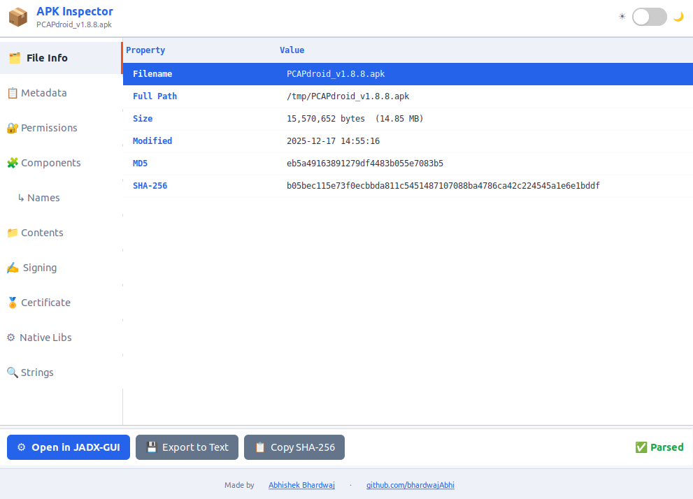 | 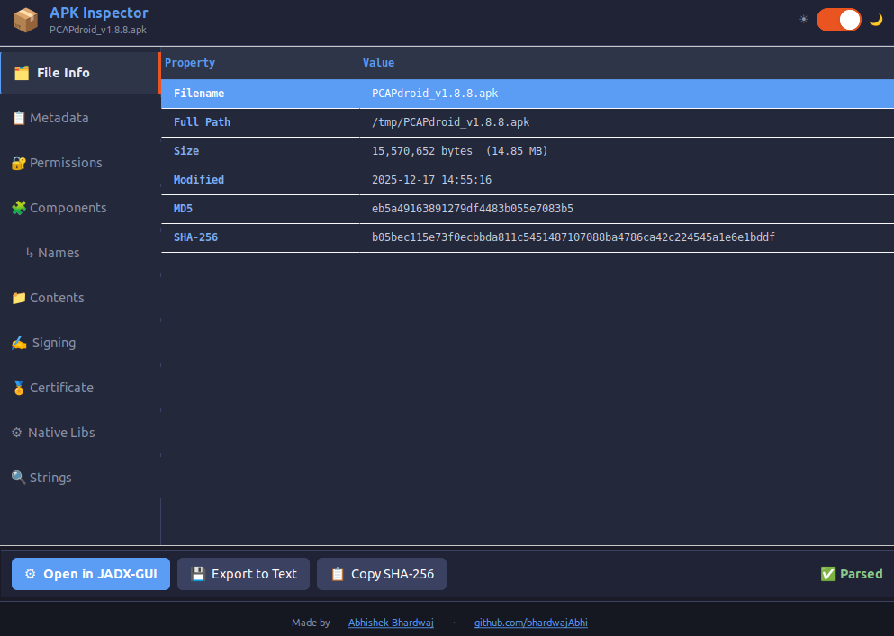 | 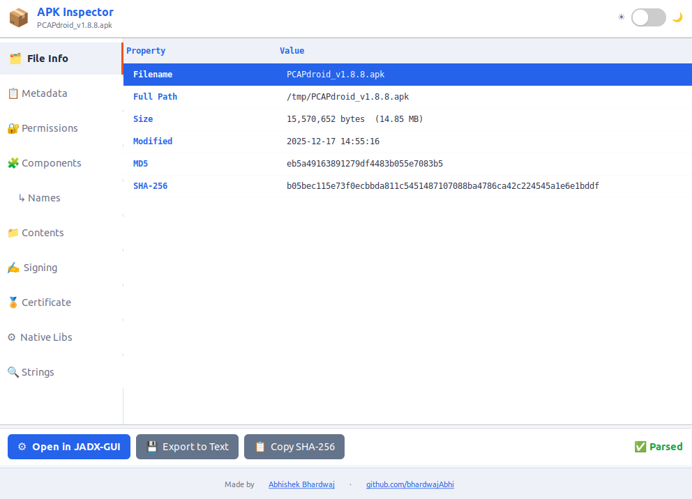 |
| **📋 Metadata** | **🔐 Permissions** | **🧩 Components** |
| 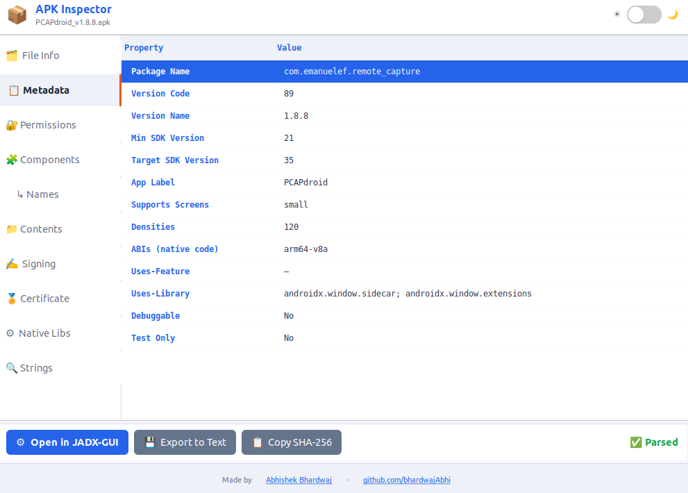 | 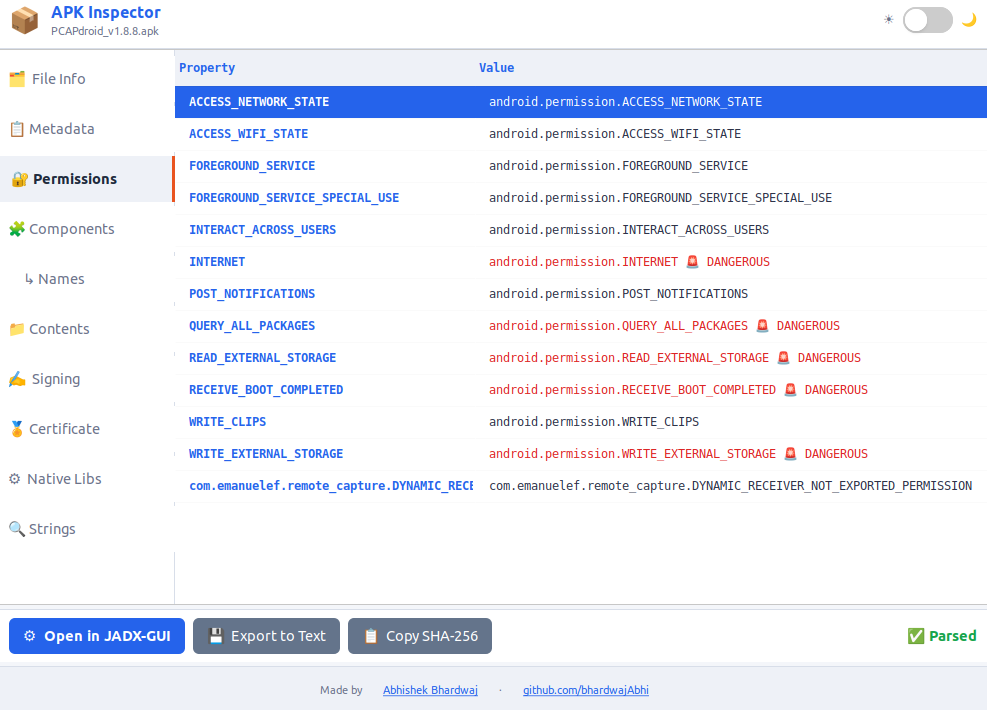 | 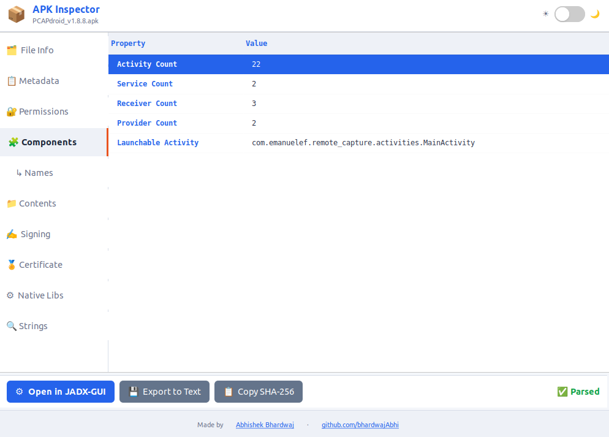 |
| **↳ Names** | **📁 Contents** | **✍ Signing** |
| 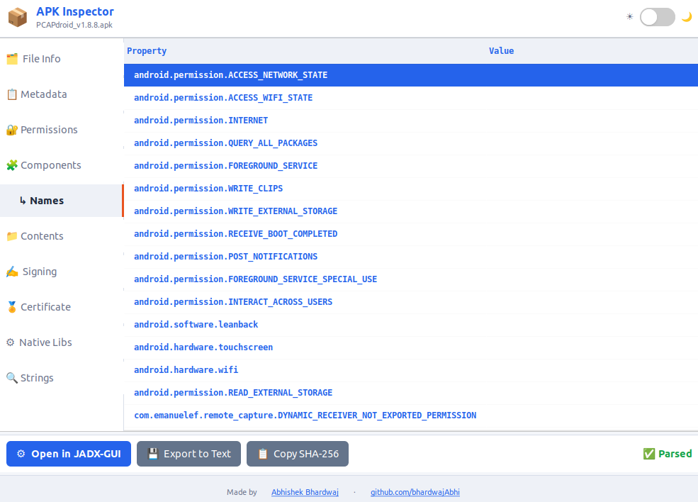 | 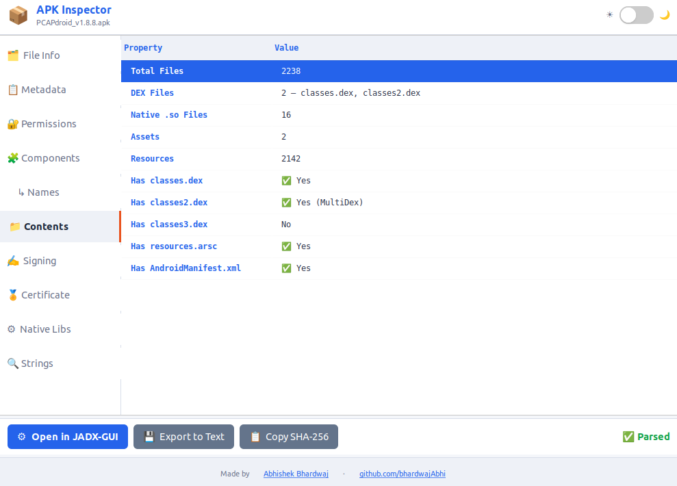 | 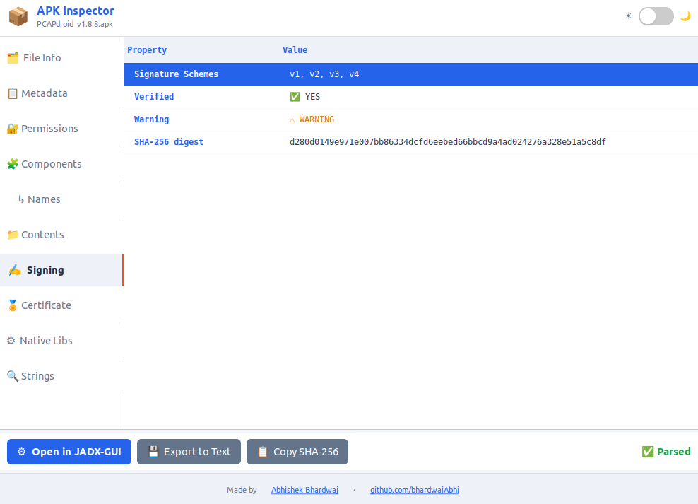 |
| **🏅 Certificate** | **⚙ Native Libs** | **🔍 Strings** |
| 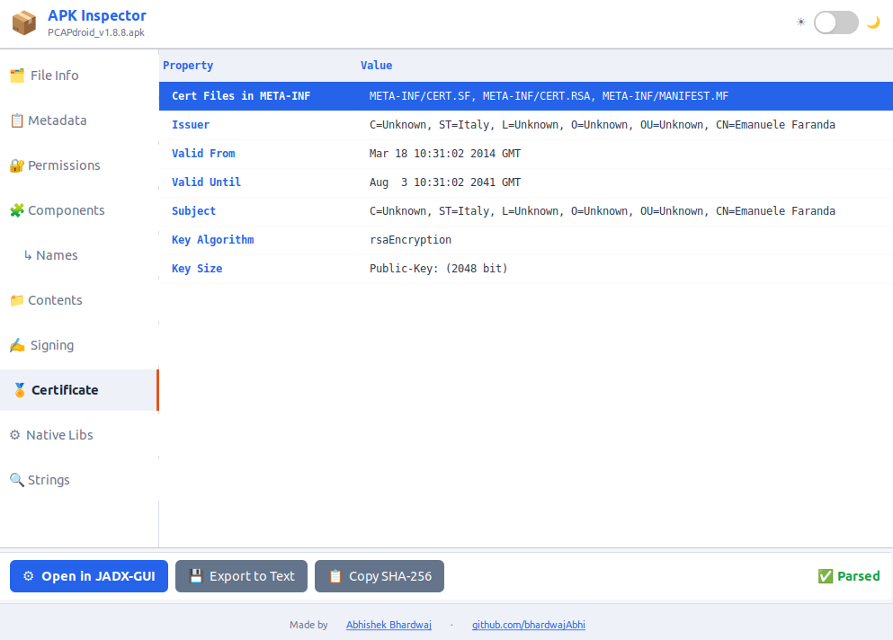 | 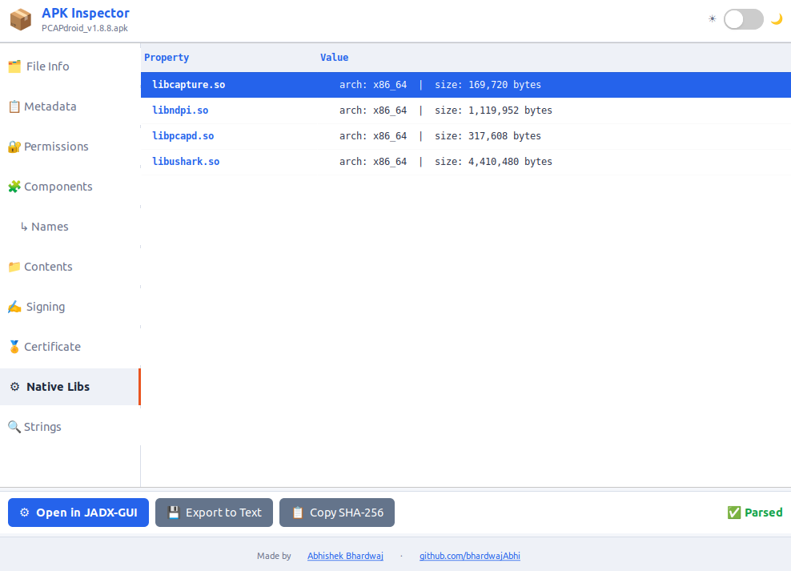 | 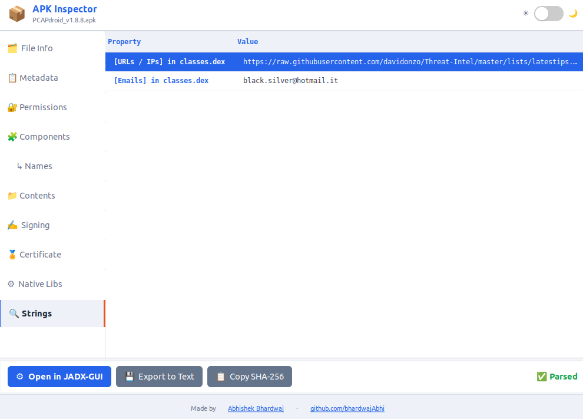 |

---

## ✨ Features

| Tab | What you get |
|-----|-------------|
| 🗂 File Info | Filename, path, size, MD5, SHA-256 |
| 📋 Metadata | Package name, version, SDK targets, debuggable flag |
| 🔐 Permissions | All declared permissions — **dangerous ones in red** |
| 🧩 Components | Activity / Service / Receiver / Provider counts |
| 📁 APK Contents | DEX count, native libs, assets, MultiDex detection |
| ✍ Signing | apksigner output — v1/v2/v3/v4 scheme, verified status |
| 🏅 Certificate | Subject, issuer, validity, key size, SHA fingerprints |
| ⚙ Native Libs | All `.so` files with architecture (arm64-v8a, x86_64…) |
| 🔍 Strings | URLs, IPs, emails, API keys, crypto addresses |

**Toolbar:** Open in JADX-GUI · Export report · Copy SHA-256 · Click any row to copy

**Appearance:** Light theme by default · ☀ / 🌙 toggle for dark mode

---

## 🗺 Roadmap

### ✅ Available now

- **Ubuntu / Nautilus** — right-click → Scripts → Get APK Details
- **APK analysis tabs** — file info, metadata, permissions, components, contents, signing, certificate, native libs, strings
- **Quick actions** — export report, copy SHA-256, open in JADX-GUI
- **UI** — clean GTK window with light / dark theme toggle

### 🔜 Coming next

- **Windows Explorer** — context menu integration
- **macOS Finder** — Finder service integration
- **Deeper analysis** — richer manifest view, IOC export, batch triage

---

## 🚀 Quick Install

```bash
git clone https://github.com/bhardwajAbhi/apk-inspector.git
cd apk-inspector
bash install.sh
```

The installer will:
- Copy the GUI to `~/.local/share/apk-inspector/`
- Install a Nautilus script at `~/.local/share/nautilus/scripts/Get APK Details`
- Remove any file-manager action or Nautilus extension (if present)
- Register the APK MIME type
- Reload Nautilus

---

## 🖱 Usage

1. Open **Files (Nautilus)**
2. Navigate to your `.apk` file
3. **Right-click** → **Scripts** → **Get APK Details**
4. Use the **☀ / 🌙 switch** (top-right) to toggle dark mode

---

## 🛠 Dependencies

| Tool | Install | Purpose |
|------|---------|---------|
| `aapt` / `aapt2` | `sudo apt install aapt` | Metadata, permissions, components |
| `apksigner` | `sudo apt install apksigner` | Signature verification |
| `openssl` | Pre-installed on Ubuntu | Certificate parsing |
| `python3-gi` | `sudo apt install python3-gi gir1.2-gtk-3.0` | GTK3 GUI |
| `jadx-gui` | [github.com/skylot/jadx](https://github.com/skylot/jadx/releases) | Source decompilation *(optional)* |

```bash
sudo apt install aapt apksigner openssl unzip python3-gi gir1.2-gtk-3.0
```

---

## 🔧 Manual Testing

```bash
python3 ~/.local/share/apk-inspector/apk_inspector.py /path/to/sample.apk
```

---

## 📁 Project Structure

```
apk-inspector/
├── install.sh
├── README.md
├── docs/                      ← GitHub Pages website
├── scripts/
│   ├── apk_inspector.py       ← GTK3 GUI app
│   └── Get APK Details        ← Nautilus script (reference copy)
└── actions/
    └── apk-inspector.desktop  ← Legacy reference only
```

---

## 💡 Tips for Malware Analysis

- **Permissions:** Watch for `READ_SMS`, `BIND_ACCESSIBILITY_SERVICE`, `SYSTEM_ALERT_WINDOW`, `INSTALL_PACKAGES`
- **Signing:** Self-signed certs with `CN=Android Debug` suggest sideloaded/repackaged APKs
- **Debuggable flag:** `android:debuggable=true` in production apps is suspicious
- **Strings:** Hardcoded C2 URLs, API keys, or suspicious domains
- Export the report and paste SHA-256 into [VirusTotal](https://www.virustotal.com) or [MalwareBazaar](https://bazaar.abuse.ch)

---

## 🔄 Uninstall

```bash
rm -rf ~/.local/share/apk-inspector
rm -rf ~/.config/apk-inspector
rm -f  ~/.local/share/nautilus/scripts/"Get APK Details"
rm -f  ~/.local/share/nautilus-python/extensions/apk_inspector_nautilus.py
rm -f  ~/.local/share/file-manager/actions/apk-inspector.desktop
nautilus -q
```

---

## ❓ FAQ

### How do I access APK Inspector after installing?

1. Open **Files (Nautilus)**
2. Navigate to any `.apk` file
3. **Right-click** the file
4. Hover over **Scripts**
5. Click **Get APK Details**

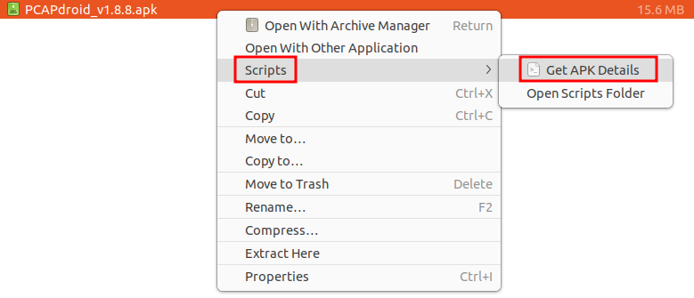

### Why don't I see "Get APK Details" under Scripts?

Re-run the installer and restart Nautilus:

```bash
bash install.sh
nautilus -q
```

Confirm the script is installed:

```bash
ls -l ~/.local/share/nautilus/scripts/"Get APK Details"
```

### Can I run it without the file manager?

```bash
python3 ~/.local/share/apk-inspector/apk_inspector.py /path/to/sample.apk
```

### Will Windows and Mac be supported?

Ubuntu / Nautilus is available today. Windows Explorer and macOS Finder integrations are on the roadmap.

### Does re-running `install.sh` overwrite the old version?

Yes. It safely replaces the installed files with the latest version. Your theme preference in `~/.config/apk-inspector/settings.json` is kept.

---

## 👤 Author

**Made by [Abhishek Bhardwaj](https://github.com/bhardwajAbhi)** · [github.com/bhardwajAbhi](https://github.com/bhardwajAbhi)
